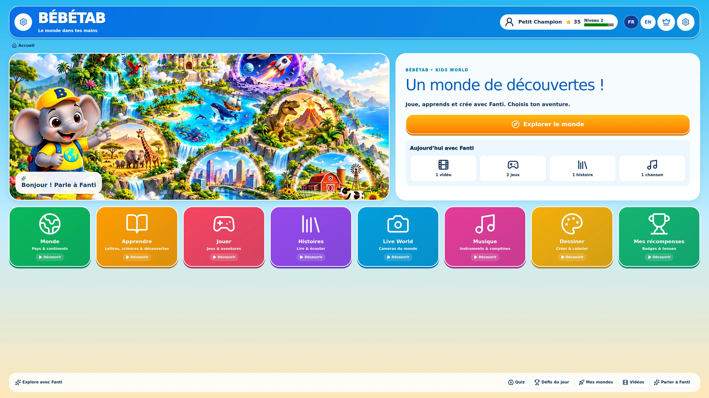

# Captures UHD

Les 19 captures `uhd/*.webp` proviennent de l’application interactive à une taille de viewport de **3840 × 2160**. Leur encodage WebP conserve ces dimensions. Les illustrations source de Fanti sont en **1672 × 941**, avec une interface et des icônes vectorielles indépendantes.

Voir [le catalogue des écrans](../docs/SCREENS.md). Les captures présentent des données de test locales.
